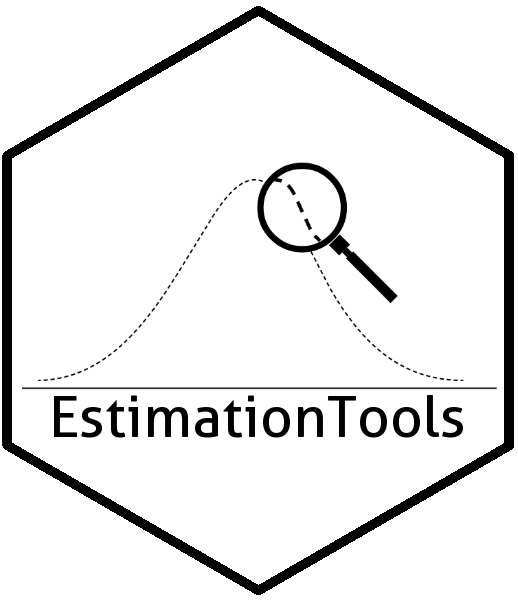

---
output:
  github_document:
    pandoc_args: --webtex
---

<!-- README.md is generated from README.Rmd. Please edit that file -->

```{r, include = FALSE}
knitr::opts_chunk$set(
  collapse = TRUE,
  comment = "#>",
  fig.path = "man/figures/README-",
  out.width = "100%"
)
```
[](https://travis-ci.org/Jaimemosg/EstimationTools)
[](https://ci.appveyor.com/project/Jaimemosg/EstimationTools)
[](https://cran.r-project.org/package=EstimationTools)
[](https://www.repostatus.org/#active)
[](https://cran.r-project.org/package=EstimationTools) 
[](https://www.gnu.org/licenses/gpl-3.0.en.html)

# EstimationTools 

<!-- badges: start -->
<!-- badges: end -->

The goal of `EstimationTools` is to provide a routine for parameter estimation of probability density/mass functions in `R`.

## Installation

You can install the lastest version of `EstimationTools` typing the following command lines
in `R` console:

``` {r eval=FALSE}
if (!require('devtools')) install.packages('devtools')
devtools::install_github('Jaimemosg/EstimationTools', force = TRUE)
library(EstimationTools)
```

Or you can install the released version from  [CRAN](https://cran.r-project.org/package=EstimationTools) if you prefer. You can also type the following command lines
in `R` console:

```{r eval=FALSE}
install.packages("EstimationTools")
```

You can visit the [package website](https://Jaimemosg.github.io/EstimationTools/) to explore the vignettes (articles) and functions reference. 

## Example

This is a basic example which shows you how to solve a common maximum likelihood estimation problem with `EstimationTools`:

$$
\begin{aligned} 
X &\sim N(\mu, \:\sigma^2) \\
\mu &= 160 \quad (\verb|mean|) \\
\sigma &= 6 \quad (\verb|sd|)
\end{aligned}
$$

The solution for a data set generated with size $n=10000$ is showed below

```{r example, message=FALSE, warning=FALSE}
library(EstimationTools)

x <- rnorm( n = 10000, mean = 160, sd = 6 )
fit <- maxlogL( x = x, dist = "dnorm", link = list(over = "sd", fun = "log_link") )
summary(fit)
```
