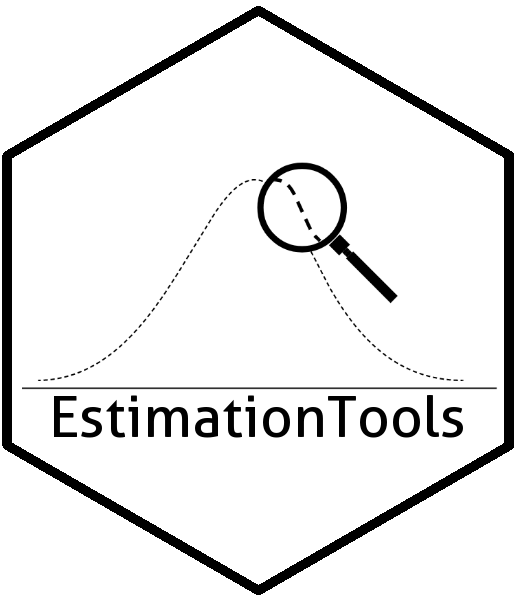

<!-- README.md is generated from README.Rmd. Please edit that file -->

<!-- badges: start -->

[](https://github.com/Jaimemosg/EstimationTools/actions)
[](https://ci.appveyor.com/project/Jaimemosg/EstimationTools)<!-- [](https://codecov.io/gh/Jaimemosg/EstimationTools?branch=master) -->
[](https://app.codecov.io/gh/Jaimemosg/EstimationTools?branch=master)
[](https://cran.r-project.org/package=EstimationTools)
[](https://cran.r-project.org/package=EstimationTools)
[](https://lifecycle.r-lib.org/articles/stages.html#maturing)
[](https://www.repostatus.org/#active)
[](https://www.gnu.org/licenses/gpl-3.0.en.html)

<!-- [](https://travis-ci.org/Jaimemosg/EstimationTools) -->

<!-- [](https://cran.r-project.org/package=EstimationTools) -->

<!-- badges: end -->

# EstimationTools 

<!--  -->

The goal of `EstimationTools` is to provide tools and routines for
maximum likelihood estimation of probability density/mass functions in
`R`.

<!-- _Edit (17/03/2021)_ -- We have performed a TTT plot implementation. You can find out in our [changelog](https://jaimemosg.github.io/EstimationTools/news/index.html). -->

<!-- _Edit (27/07/2020)_ -- We have implemented new tools and we have performed some deep modifications in our `summary` method for `maxlogL` objects. You can find out in our [changelog](https://jaimemosg.github.io/EstimationTools/news/index.html). -->

## Installation

You can install the latest version (4.3.1) of `EstimationTools` typing
the following command lines in `R` console:

``` r
if (!require('devtools')) install.packages('devtools')
devtools::install_github('Jaimemosg/EstimationTools', force = TRUE)
library(EstimationTools)
```

<!-- 4.3.1 -->

Or you can install the released version (4.0.0) from
[CRAN](https://cran.r-project.org/package=EstimationTools) if you
prefer. You can also type the following command lines in `R` console:

``` r
install.packages("EstimationTools")
```

You can visit the [package
website](https://Jaimemosg.github.io/EstimationTools/) to explore the
functions reference and our vignettes (articles).

## Examples

You can visit our estimation
[vignette](https://jaimemosg.github.io/EstimationTools/articles/Examples.html)
to see the examples.
